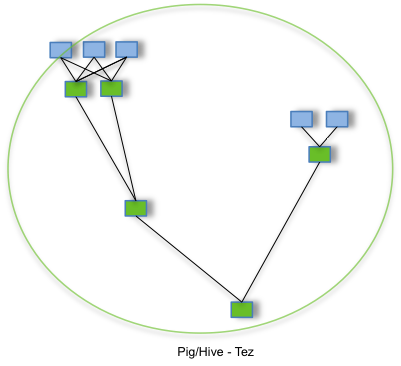

# HIVE OPTIMIZATION TECHNIQUES
````text
Apache Hive is a query and analysis engine which is built on top of Apache Hadoop and uses MapReduce Programming Model. 
It provides an abstraction layer to query big-data using the SQL syntax by implementing 
traditional SQL queries using the Java API. 
The main components of the Hive are as follows:

    - Metastore
    - Driver
    - Compiler
    - Optimizer
    - Executor
    - Client

While Hadoop/hive can process nearly any amount of data, but optimizations can lead to big savings, 
proportional to the amount of data, in terms of processing time and cost. 
There are a whole lot of optimizations that can be applied in the hive. 
Let us look into the optimization techniques we are going to cover:

    - Partitioning
    - Bucketing
    - Using Tez as Execution Engine
    - Using Compression
    - Using ORC Format
    - Join Optimizations
    - Cost-based Optimizer
````

### Partitioning
````text   
Partitioning divides the table into parts based on the values of particular columns. 
A table can have multiple partition columns to identify a particular partition. 
Using partition it is easy to do queries on slices of the data. 
The data of the partition columns are not saved in the files. 
On checking the file structure you would notice that it creates folders 
on the basis of partition column values. This makes sure that only relevant data is read 
for the execution of a particular job, decreasing the I/O time required by the query. 
Thus, increasing the query performance.
   
When we query data on a partitioned table, it will only scan the relevant partitions 
to be queried and skips irrelevant partitions. Now, assume that even on partitioning, 
the data in a partition was quite big, to further divide it into more manageable chunks we can use Bucketing.
````
````mysql-sql
CREATE TABLE table_name 
(column1 data_type, column2 data_type, …) 
PARTITIONED BY (partition1 data_type, partition2 data_type,….);
````
````text
- Partition Columns are not defined in the Column List of the table.
- In insert queries, partitions are mentioned in the start and 
  their column values are also given along with the values of the other columns but at the end.
````
````mysql-sql
INSERT INTO TABLE table_name PARTITION (partition1 = ‘partition1_val’, partition2 = ‘partition2_val’, …) 
VALUES (col1_val, col2_val, …, partition1_val, partition2_val, …);
````
````text
- Partitioning is basically of two types: Static and Dynamic. 
  Well, names are very much self-explanatory.

 * Static Partitioning
   This is practiced when we have knowledge about the partitions of data we are going to load. 
   It should be preferred when loading data in a table from large files. 
   It is performed in strict mode:
````
````properties
set hive.mapred.mode = strict;
````
````text
 * Dynamic Partitioning
   It is used when we do not have knowledge about the partitions of the data. 
   It takes more time to load data in the table. Usually, 
   we load data in the table using another table having non-partitioned data.
   To enable dynamic partitioning in the hive:
````
````properties
SET hive.exec.dynamic.partition = true;
````

````text
There are two modes of dynamic partitioning:
Strict: This needs at least one column to be static while loading the data.
Non-strict: This allows us to have dynamic values of all the partition columns.
````
````properties
SET hive.exec.dynamic.partition.mode = nonstrict;
````
````text
Some other things are to be configured when using dynamic partitioning, like
````
````properties
Hive.exec.max.dynamic.partitions.pernode: 
#Maximum number of partitions to be created in each mapper/reducer node
````
````properties
Hive.exec.max.dynamic.partitions: \
#Maximum number of dynamic partitions allowed to be created in total
````
````properties
Hive.exec.max.created.files: \
#Maximum number of HDFS files created by all mappers/reducers in a MapReduce job
````
````properties
Hive.error.on.empty.partition: 
#Whether to throw an exception if the dynamic partition insert generates empty results
````

### Bucketing
````text
Bucketing provides flexibility to further segregate the data 
into more manageable sections called buckets or clusters. 
Bucketing is based on the hash function, which depends on the 
type of the bucketing column. 
Records which are bucketed by the same column value 
will always be saved in the same bucket. 
CLUSTERED BY clause is used to divide the table into buckets. 
It works well for the columns having high cardinality.
````
````mysql-sql
CREATE TABLE table_name (
  column1 data_type, 
  column2 data_type, …) 
PARTITIONED BY (partition1 data_type, partition2 data_type,….) 
CLUSTERED BY (clus_col1) SORTED BY (sort_col2) INTO n BUCKETS;
````
````text
In Hive Partition, each partition will be created as a directory. 
But in Hive Buckets, each bucket will be created as a file.
````
````properties
set hive.enforce.bucketing = true;
````
````text
Using Bucketing we can also sort the data using one or more columns. 
Since the data files are equal-sized parts, map-side joins 
will be faster on the bucketed tables.

Bucketing also has its own benefit when used with ORC files 
and used as the joining column. We will further discuss these benefits.
````

### Using Tez as Execution Engine
````text
Apache Tez is a client-side library which operates like an execution engine, 
an alternative to traditional MapReduce Engine, 
under Hive and Pig which allows faster processing of jobs using the DAG formation.

To look into how Tez helps in optimizing the jobs, 
we will first look into the stereotyped processing sequence of a MapReduce Job:
````

````text
- The Mapper function reads data from the file system, 
  processes it into Key-Value Pairs which is further 
  stored temporarily on the local disk. 
  These Key-value pairs, grouped on the key values, 
  are sent to the reducers over the network.

- On nodes where Reducers are to be run, 
  the data is received and is saved on the local disk and waits 
  for the data from all the mappers to arrive. 
  Then, the entire set of values for a key is read into a single reducer, 
  processed and further writes the output which is then further replicated based on the configuration.

- As you can notice a whole lot of unnecessary read/write overhead is involved 
  in a single MapReduce job. Multiple MapReduce jobs are run to accomplish 
  a single Hive query and all outputs of the MapReduce Jobs are first written 
  in the DFS and then transferred to nodes, and the cycle is repeated since 
  there is no coordination between two MapReduce jobs.

Apache Tez optimizes it by not breaking a Hive-query in multiple MapReduce Jobs. 
Since, Tez is a client-side library, to orchestrate the processing of MapReduce Jobs. 
Tez optimizes the jobs using the steps like the following:
````

````text
- Skipping the DFS write by the reducers and piping the output 
  of a reducer directly in the subsequent Mapper as input.
- Cascading a series of Reducers without intervening Mapper steps.
- Re-use of containers for successive phases of processing.
- Optimal Resource usage using Pre-warmed containers.
- Cost-based Optimizations.
- Vectorized Query Processing.

We can set the execution engine using the following query, or by setting it in the hive-site.xml.
````
````properties
set hive.execution.engine=tez/mr
````

### Using Compression
````text
As you might have noticed that hive queries involve a lot of Disks I/O or Network I/O operations, 
which can be easily reduced by reducing the size of the data which is done by compression. 
Most of the data formats in Hive are the text-based formats which are 
very compressible and can lead to big savings. 
But, there is a trade-off involved when we take compression into consideration, 
the CPU cost of compression and decompression.

Following are the main situations where I/O operations are performed and compression can save cost:

- Reading data from a local DFS directory
- Reading data from a non-local DFS directory
- Moving data from reducers to the Next stage Mappers/Reducers
- Moving the final output back to the DFS.

Also, DFS replicates the data as well to be fault-tolerant, 
there are more I/O operations involved when we are replicating data.

You can import text files compressed with Gzip or Bzip2 directly into a table stored as TextFile. 
Compressed data can directly be loaded in Hive, using the LOAD statement 
or by creating table over compressed data location. 
The compression will be detected automatically and the file will be decompressed 
on-the-fly during query execution. 
However, in this case, Hadoop will not be able to split your file into 
chunks/blocks and run multiple maps in parallel. 
But, zipped sequence files can be split into multiple.

The above optimizations will save a whole lot of execution cost 
and will lead to pretty quicker execution of jobs.
````

### Using ORC Format
````text
Choosing the correct file format can be another thing which can optimize 
the processing job to a great extent. Hive supports a big family of file-formats:

- Text File
- SequenceFile
- RCFiles
- Avro Files
- ORC Files
- Parquet
- Custom INPUTFORMAT and OUTPUTFORMAT

Before, any of these columnar-format most of the data was stored in the form of delimited text files. 
In these files, even if we have to read only one column we have to read and parse 
the whole record for each row. ORC files enable numerous optimizations in Hive like the following:

- Achieves higher level of compression, the compression algorithm 
  can be changed using orc.compress setting in the hive. By default, it uses Zlib Compression.
- It has the ability to skip scanning an entire range of rows within a block, 
  if irrelevant to the query, using the light-weight indexes stored within the file.
- It has the ability to skip decompression of rows within a block, 
  if irrelevant to the query.
- Single file as the output of each task, reducing the load on the name node.
- It supports multiple streams to read the file simultaneously.
- It keeps the metadata stored in the file using Protocol Buffers, 
  used for serializing structured data.

The ORC storage strategy is both column-oriented and row-oriented. 
An ORC format file consists of tabular data that is written in “stripes” of a convenient size 
to process in a single mapper (256 MB and 512 MB are common sizes.) 
Stripes may or may not be processed by separate tasks, and a single ORC file can contain many stripes, 
each of which is independent. In stripes, the columns are compressed separately, 
only the columns that are in the projection for a query need be decompressed.
````

````text
Within a stripe the data is divided into 3 Groups:
1. The stripe footer contains a directory of stream locations.
2. Row data is used in table scans, by default contains 10,000 rows.
3. Index data include min and max values for each column and row positions within each column. 
   Row index entries provide offsets that enable seeking to the right compression block 
   and byte within a decompressed block. Note that ORC indexes are used only 
   for the selection of stripes and row groups and not for answering queries.

Just using ORC format, gives rise to the following optimizations:
- Push-down Predicates
- Bloom Filters
- ORC Compression
- Vectorization
````
##### Push-down Predicates
````text
The ORC reader uses the information present in the Index data of the stripes, 
to make sure whether the data in the stripe is relevant to the query or not. 
So, essentially the where conditions of the query are passed to the ORC Reader, 
before bothering to unpack the relevant columns from the row data block. 
For instance, if the value from the where condition is not within the min/max range for a block, 
the entire block can be skipped.
````
##### Bloom Filters
````text
Bloom Filters is a probabilistic data structure that tells us whether an element is present 
in a set or not by using a minimal amount of memory. A catchy thing about bloom filters is that 
they will occasionally incorrectly answer that an element is present when it is not. 
Their saving grace, however, is that they will never tell you that an element is not present if it is.

Bloom Filters again helps in the push-down predicates for ORC File formats. 
If a Bloom filter is specified for a column, even if the min/max values in a row-group’s index say 
that a given column value is within the range for the row group, the Bloom filter can answer specifically 
whether the value is actually present. If there is a significant probability that values 
in a where clause will not be present, this can save a lot of pointless data manipulation.

We can set the bloom filter columns and bloom filter’s false positive probability using the following table properties:

- orc.bloom.filter.columns: comma-separated list of column names for which bloom filter should be created
- orc.bloom.filter.fpp: false positive probability for bloom filter.
````
##### ORC Compression
````text
ORC format not only compresses the values of the columns but also compresses the stripes as a whole. 
It also provides choices for the overall compression algorithm. 
It allows the following compression algorithm to be used:

- Zlib: Higher Compression. Uses more CPU and saves space.
- Snappy : Compresses less. Uses less CPU and more space.
- None: No compression at all.

If the CPU is tight, you might want to use Snappy. Rarely will you want to use none, 
which is used primarily for diagnostic purposes. Also, the Hive’s writer is intelligent 
if it does not foresee any marginal gain, it will not compress the data.
````
##### Vectorization
````text
Query Operations like scanning, filtering, aggregations, and joins can be optimized 
to a great extent using the vectorized query execution. A standard query execution processes 
one row at a time and goes through a long code path as well as significant metadata interpretation.

Vectorization optimizes the query execution by processing a block of 1024 rows at a time, 
inside which each row is saved as a vector. On vectors, simple arithmetic and 
comparison operations are done very quickly. Execution is speeded up because within 
a large block of data of the same type, the compiler can generate code to execute identical functions 
in a tight loop without going through the long code path that would be required 
for independent function calls. This SIMD-like behavior gives rise to a host of low-level efficiencies: 
fewer instructions executed, superior caching behavior, improved pipelining, more favorable TLB behavior, etc.

Not every data type and operation can benefit from vectorization, but most simple operations do, 
and the net is usually a significant speedup.

To use vectorized query execution, you must store your data in ORC format, 
and set the following variable as shown in Hive SQL:
````
````properties
    set hive.vectorized.execution.enabled = true;

    set hive.vectorized.execution.reduce.enabled=true

    set hive.vectorized.execution.reduce.groupby.enabled=true
````
````text
We can check if the query is being executed in a vectorized manner using the Explain Command. 
In the output of the Explain Command, you will probably see the following in different stages:

Execution mode: vectorized
````
### Join Optimizations
````text
So, before delving into the join optimizations, let’s understand how a common join query 
is actually executed using MapReduce.

- Mappers do the parallel sort of the tables on the join keys, which are then passed on to reducers.
- All of the tuples with the same key is given to the same reducer. 
  A reducer may get tuples for more than one key. Key for tuple will also include table id, 
  thus sorted output from two different tables with the same key can be recognized. 
  Reducers will merge the sorted stream to get join output.

One thing to keep in mind while writing the join query is the table which is mentioned 
last is streamed through the reducers, rest all are buffered in the memory in the reducers. 
So, we should always keep in mind that the large table is mentioned in the last 
which will lessen the memory needed by the reducer, or we can use the STREAMTABLE hint.
````
````mysql-sql
SELECT /*+ STREAMTABLE(a) */ a.val, b.val, c.val 
FROM a 
JOIN b ON (a.key = b.key1) 
JOIN c ON (c.key = b.key1)
````
````text
Another thing to pay attention to when where clause is used with a join, 
then join part is executed first and then the results are filtered using the where clauses. 
Like, in the below query:
````
````mysql-sql
SELECT a.val, b.val FROM a 
LEFT OUTER JOIN b ON (a.key=b.key) 
WHERE a.ds='2009–07–07' AND b.ds='2009–07–07'
````
````text
While the same filtering of the records could have been executed along when joining the tables. 
This can be done by including the filtering conditions along with the join conditions.
````
````mysql-sql
SELECT a.val, b.val 
FROM a 
LEFT OUTER JOIN b ON (a.key=b.key AND b.ds='2009–07–07' AND a.ds='2009–07–07')
````
````text
This join includes a shuffle phase in which outputs of the mappers is sorted and shuffled 
with the join keys, which takes a big cost to be executed in terms of processing, 
I/O and data transfer cost. So, to reduce the above-mentioned costs, 
a lot of join algorithms have been worked on, like:

- Multi-way Join
- Map Join
- Bucket Map Join
- SMB Join
- Skew Join
````
##### Multi-way Join
````text
If multiple joins share the same driving side join key then all of those joins can be done in a single task.
Example: (R1 PR1.x=R2.a — R2) PR1.x=R3.b — R3) PR1.x=R4.c — R4
All of the joins can be done in the same reducer since R1 will already be sorted based on join key x.
Hence, Reducing the number of reducers by doing all reducing task in just one reducer. 
Hive does this optimization itself and manages it internally. Like in the below query:
````
````mysql-sql
SELECT a.val, b.val, c.val 
FROM a 
JOIN b ON (a.key = b.key1) 
JOIN c ON (c.key = b.key1)
````
##### Map Join (Broadcast Join or Broadcast-Hash Join)
````text
Useful for star schema joins, this joining algorithm keeps all of the small tables 
(dimension tables) in memory in all of the mappers and big table (fact table) 
is streamed over it in the mapper. This avoids shuffling cost that is inherent in Common-Join. 
For each of the small table (dimension table), a hash table would be created using join key 
as the hash table key and when merging the data in the Mapper Function, 
data will be matched with the mapping hash value.

But the constraint is, all but one of the tables being joined are small, 
the join can be performed as a map only job.

Hive can optimize join into the Map-Side join, if we allow it to optimize 
the joins by doing the following setting:
````
````properties
set hive.auto.convert.join=true;
set hive.auto.convert.join.noconditionaltask = true;
set hive.auto.convert.join.noconditionaltask.size = 10000000;
````
````text
The first two settings will allow hive to optimize the joins and third setting 
will give hive an idea about the memory available in the mapper function 
to keep the hash table of the small tables.

Or else, we can also use MAPJOIN hint in the query, such as:
````
````mysql-sql
SELECT /*+ MAPJOIN(b) */ a.key, a.value
FROM a 
JOIN b ON a.key = b.key
````
````text
But the restriction is, full outer join AND right outer join cannot be performed for the table b.
````

##### Bucket Map Join
````text
Let’s assume that the size of the tables bigger to fit in the memory of the Mapper. 
But when chunked into buckets can fit in the memory, the tables being joined are bucketized 
on the join columns, and the number of buckets in one table is a multiple 
of the number of buckets in the other table, the buckets can be joined with each other 
by creating a hash table of the smaller table’s bucket in the memory and streaming 
the other table’s content in the mapper. Assuming, If table A and B have 4 buckets each, 
the following join can be done on the mapper only.
````
````mysql-sql
SELECT /*+ MAPJOIN(b) */ a.key, a.value
FROM a 
JOIN b ON a.key = b.key
````
````text
Instead of fetching B completely for each mapper of A, only the required buckets are fetched. 
For the query above, the mapper processing bucket 1 for A will only fetch bucket 1 of B. 
It is not the default behavior, and is governed by the following parameter.
````
````properties
set hive.optimize.bucketmapjoin = true
````

##### Sort-Merge-Bucket Join
````text
This is an optimization on Bucket Map Join; if data to be joined is already sorted on joining keys 
then hash table creation is avoided and instead a sort-merge join algorithm is used. 
This join can be used using the following settings:
````
````properties
set hive.input.format= org.apache.hadoop.hive.ql.io.BucketizedHiveInputFormat;
set hive.optimize.bucketmapjoin = true;
set hive.optimize.bucketmapjoin.sortedmerge = true;
````
````text
The query would be the same as the above query, and the hive would form its execution strategy.
````
````mysql-sql
SELECT /*+ MAPJOIN(b) */ a.key, a.value
FROM a 
JOIN b ON a.key = b.key
````

##### Skew Join
````text
If the distribution of data is skewed for some specific values, then join performance may suffer 
since some of the instances of join operators (reducers in the map-reduce world) may get overloaded 
and others may get underutilized. On user hint, hive would rewrite a 
join query around skew value as union of joins. So, it would execute one query to implement 
join of the skewed key and other for the rest of the join keys, 
and would further merge the outputs of both the queries.

Example R1 PR1.x=R2.a — R2 with most data distributed around x=1 then this join may be rewritten as 
(R1 PR1.x=R2.a and PR1.x=1 — R2) union all (R1 PR1.x=R2.a and PR1.x<>1 — R2)
````
````properties
set hive.optimize.skewjoin = true;
set hive.skewjoin.key=500000;
````

##### Cost-based Optimizations
````text
So, we all will agree to the saying that there could be multiple solutions to one problem 
and until the rise of the cost-based optimizer, hive used the hard-coded query plans to execute a single query. 
The CBO lets hive optimize the query plan based on the metadata gathered. 
CBO provides two types of optimizations: logical and physical.

* Logical Optimizations:

    - Projection Pruning
    - Deducing Transitive Predicates
    - Predicate Pushdown
    - Merging of Select-Select, Filter-Filter into a single operator
    - Multi-way Join
    - Query Rewrite to accommodate for Join skew on some column values

* Physical Optimizations:

    - Partition Pruning
    - Scan pruning based on partitions and bucketing
    - Scan pruning if a query is based on sampling
    - Apply Group By on the map side in some cases
    - Optimize Union so that union can be performed on map side only
    - Decide which table to stream last, based on user hint, in a multiway join
    - Remove unnecessary reduce sink operators
    - For queries with limit clause, reduce the number of files that needs to be scanned for the table.

Turning on CBO will typically halve the execution time for a query, and may do much better than that. 
Along with these optimizations, CBO will also transform join queries into the best possible join 
using the statistics of the table saved in the metastore.

CBO can be turned on using the following setting in the hive-site.xml file :
````
````properties
hive.cbo.enable=true
````
````text
The statistics of the table is auto gathered by hive, if hive.stats.autogather is set to True 
else could be calculated using the ANALYZE command.
````