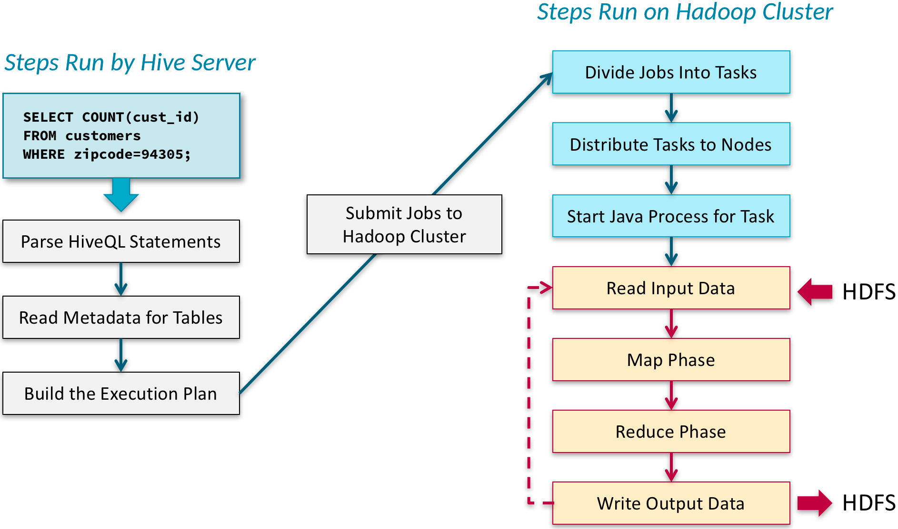
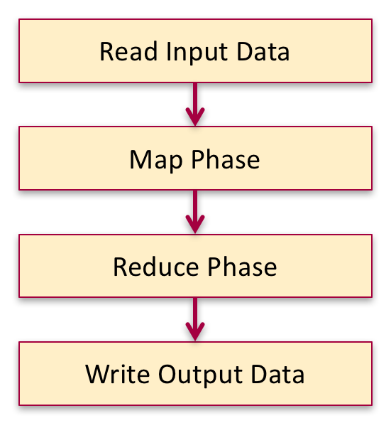
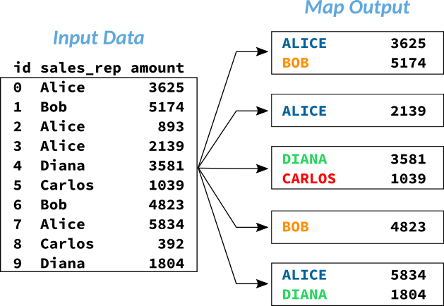
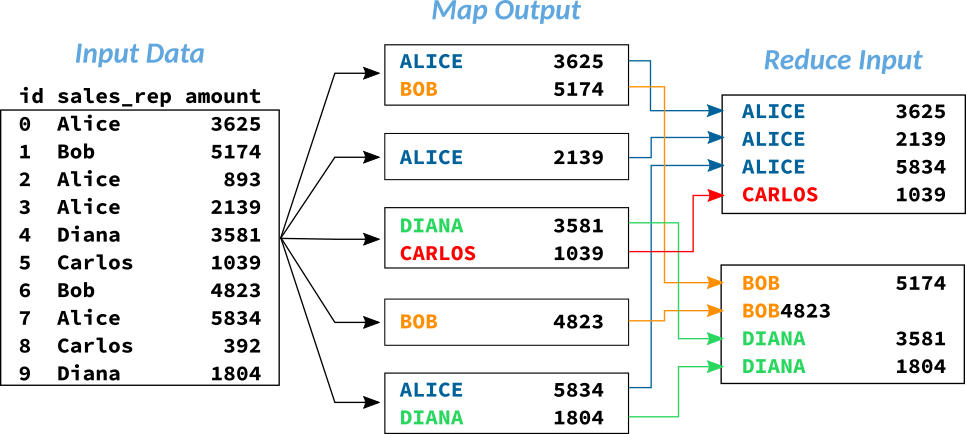
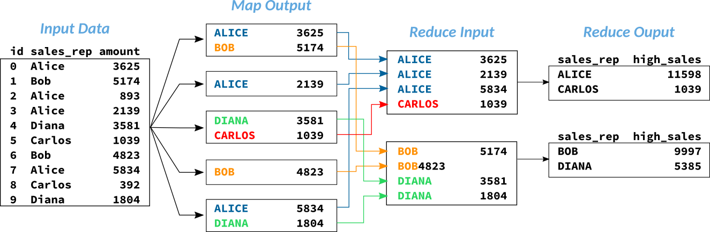
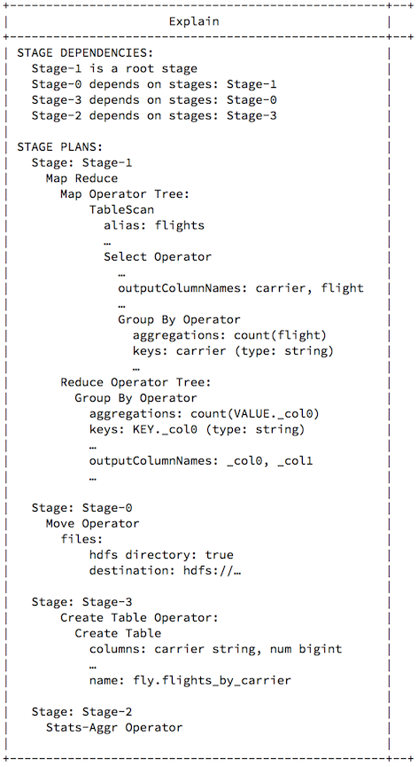
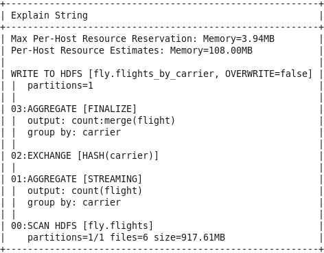

## IMPROVING QUERY PERFORMANCE

### WHAT TO DO WHEN QUERYS TAKE TOO LONG

### CHOOSING WHICH QUERY ENGINE TO USE
````text
With different query engines available to you, and with different options available in those engines, 
you'll have to decide which to use for a particular task. 
Here are some guidelines to help you decide.

First, if you're considering whether you should be using a big data system or to a relational database system, 
remember that relational databases are optimized to store relatively small amounts of data, 
to provide immediate query results, and to allow for in-place modification of data. 
Big data engines such as Hive and Impala, on the other hand, are better optimized for large amounts of read-only data. 
They provide excellent scalability at low cost. 
So if you're working with smaller amounts of data (no more than a terabyte or two) and you need in-place modification of data, 
you probably don't need or even want to use a big data system.

If you do need a big data system, Impala is typically faster than Hive 
and is good for interactive and ad-hoc queries when you're exploring data. 

However, Impala lacks some of the features that Hive provides. 
For example, a very long-running query that experiences failures (due to computers in the cluster failing, for example) 
will fail in Impala, but Hive has fault tolerance and likely will still complete the query. 
This makes Hive a good choice for batch processing and ETL jobs using SQL. 
Hive also offers extensible record formats and file formats; 
Impala is more limited in the accepted file formats.

Hive developers have found ways to improve Hive's query performance in recent versions. 
Hive works by creating jobs that run in a different engine 
(originally MapReduce, which can be rather slow) and the underlying engine can be changed. 
Rather than MapReduce, you may be able to use Apache Spark or Apache Tez, both of which are faster than MapReduce. 
Newer versions of Hive also support an architecture called LLAP (Live Long And Process) 
which caches metadata similarly to Impala, reducing query latency. 
You may want to test some typical queries against your own tables 
to see if one of these works better for you than Impala for interactive and ad-hoc queries.

There are a few other considerations when deciding how to complete tasks in big data systems. 
While both Hive and Impala can insert individual records into a table, 
this is not a recommended way to populate a table, because it tends to create small files that are inefficient to process. 
Recent versions of Hive do include some limited support for updating and deleting records, 
but full transactions (including COMMIT and ROLLBACK) are not yet implemented. 
Hive and Impala do not support stored procedures, as relational databases do. 
Relational database engines also typically have extensive support for indexing, 
while Hive has only limited support for indexing, and Impala does not support it. 
However, if you need the speed for searching massive datasets that indexing provides, 
other tools such as Cloudera Search, which uses Apache Solr, can be used instead.

You might also be curious about Apache Spark, which is another powerful large-scale data processing engine. 
It provides APIs for writing custom data processing code, but working directly with it requires programming skill. 
If you don't already have skills with Spark, Hive and Impala are typically a better choice for data analysis and data processing tasks.
````

### UNDERSTANDING MAP TASKS AND REDUCE TASKS
````text
If you've been using the Hive engine, you may have noticed 
that some types of queries are significantly slower than others. 
Hive is designed to hide the complexity of distributed data processing from the user. 
To use Hive, you need only issue SQL queries. 
But to understand why some types of queries finish faster than others, 
you need to know what happens when you run a Hive query.

- Hive Query Process
Hive does not have its own data processing engine; instead, 
it converts a query into one or more jobs that run on the cluster using a different engine. 
Originally, MapReduce was the exclusive data processing engine for Hive. 
Newer versions of Hive include support for Apache Spark or Apache Tez as an alternative engine. 
When you use MapReduce as Hive’s execution engine, this is called Hive on MapReduce. 
There are similar terms for Spark and Tez. 
In this reading, and as the default execution engine in the course VM, we're using Hive on MapReduce.

A Hive client application, such as Beeline or Hue, connects to a Hive server. 
When you run a query from one of these clients, the Hive server performs several operations. 
It parses the SQL, retrieves metadata from the metastore, and plans the execution of the query. 
These steps are relatively fast; they might take only a small fraction of a second for a simple query. 
See the first column, “Steps Run by Hive Server,” of Figure 1.
````

````text
Figure 1: Hive process overview

Then the Hive server submits one or more jobs to the cluster. 
On the cluster, the jobs are divided into tasks, the tasks are distributed across nodes, 
and processes are started to execute the tasks (“Steps Run on Hadoop Cluster” in Figure 1). 
Tasks are executed in a specific sequence. 
First the input data is read, then the data is processed 
through one or more map and reduce phases, and finally the result is generated. 
The steps that run on the cluster account for a large majority of a query’s total running time.

- Map and Reduce Tasks
To understand how a job on the cluster is divided up into tasks, 
you need to understand how the map-reduce data processing model works. 
The MapReduce engine used by Hive is an implementation of the map-reduce data processing model.

This model provides a way to divide a large data processing job 
into a sequence of smaller tasks that can run in parallel across a large number of computers. 
A MapReduce job is divided into two types of tasks: map tasks and reduce tasks. 
These tasks are sequenced in phases.
````

````text
Figure 2: Map-reduce job within the Hive process

- A map phase runs first. 
It is used to filter, transform, or parse data. 
In a map phase, each record of data is processed independently. 
The output from a map phase becomes the input to a reduce phase. 
A reduce phase is used to summarize or aggregate data, combining multiple records together. 
Some types of jobs don’t perform any aggregation so they don’t require a reduce phase; 
these are called map-only jobs.

- Example MapReduce Job
This example illustrates how a Hive query executes as a MapReduce job. 
The query in this example selects data from a table named order_info. 
This table has three columns representing the order ID, the name of the salesperson, and the order amount. 

SELECT upper(sales_rep), SUM(amount) AS high_sales
    FROM order_info
    WHERE amount > 1000
    GROUP BY upper(sales_rep);
````

````text
Figure 3: Example input data

Notice that salespeople can have multiple orders. 
The query groups by the sales_rep column, adjusted for case sensitivity, 
and calculates the sum of the order amounts for each salesperson. 
Executing this query requires both a map phase and a reduce phase.

In the map phase of the MapReduce job, the individual map tasks each receive a portion of the input data. 
The number of map tasks is determined primarily by the total size of the input data. 
The example in Figure 4 shows five parallel map tasks, 
but with a very large input dataset, there could be hundreds or thousands. 
````

````text
Figure 4: Map output

- The map tasks process the input records. 
They may filter, transform, or parse the input data. 
The map tasks can also project the input data, which means returning only a subset of the columns. 
That’s what the map tasks do in this example; each map task simply reads a portion 
of the input data and outputs the sales_rep and amount fields, 
discarding the order ID field because it’s not needed.

- The output from the map tasks goes through an intermediate process called shuffle and sort. 
This process merges together the output from all the map tasks to create the input to the reduce phase, 
one input dataset for each reduce task. (See Figure 5.) 
The process also sorts the data by the column or columns that the data is grouped by, 
which in this example is the sales_rep column. 
Notice here that the records for Alice are grouped together, the records for Carlos are grouped together, and so on. 
But the result is not globally ordered—notice here that Carlos comes before Bob. 
````

````text
Figure 5: Shuffle and sort

The reduce tasks are where aggregation is performed; in this example, 
they compute the sum of the order amounts for each salesperson. 
The number of reduce tasks is determined by the configuration of Hive or MapReduce, 
and it’s almost always much smaller than the number of map tasks. 
````

````
This example (Figure 6) shows two reduce tasks. 
The outputs from the reduce tasks are appended together to produce the query result. 
````

### HIVE QUERY PERFORMANCE PATTERNS
````text
The speed with which a query completes depends upon what operations Hive must perform to execute the query. 
The sections below present query patterns in order from the fastest to the slowest. 

Understanding these patterns requires an understanding of map and reduce phases, 
so if you have not yet read “Understanding Map Tasks and Reduce Tasks,” you should do so before continuing. 
How to know what phases a particular query requires may seem mysterious at this time. 
With practice, you'll get better at distinguishing map tasks from reduce tasks. 
The next reading, “Understanding Execution Plans,” will give you some tools to help you figure this out, too.

1. Only Metadata

The fastest type of query requires Hive to retrieve only metadata from the metastore, not data from the file system. 
An example of this is a DESCRIBE command. 

DESCRIBE customers;

2. Fetch Tasks

The next fastest type is a query that executes as a fetch task. 
These are SELECT queries that do not require the underlying data processing engine. 
The Hive server executes these queries by fetching data directly 
from the file system and processing it internally. 
This eliminates the overhead of starting separate processes 
to execute the job, which reduces query latency. 

SELECT * FROM customers LIMIT 10;

A fetch task can do more than simply fetching the data and returning it, 
but there are limitations. 
To execute as a fetch task, a SELECT statement must not include 
the DISTINCT keyword and must not use aggregation, windowing, or joins. 
Also, the input data must be smaller than one gigabyte. 
Some of these requirements can be changed using Hive configuration properties.

3. Only Map Phase

Next fastest is the type of query that requires only a map phase and no reduce phase. 
For example, when a query inserts data into another table, 
Hive executes the query as a map-only job.

INSERT INTO TABLE ny_customers
    SELECT * FROM customers
    WHERE state = 'NY';

4. Map and Reduce Phases

Slower yet is the type of query that requires both map and reduce phases, 
such as a query that performs aggregation. 
To execute this example, Hive projects and filters the data in the map phase, 
then aggregates it using the COUNT function in the reduce phase. 

SELECT COUNT(cust_id)
    FROM customers
    WHERE zipcode=94305;

5. Multiple Map and Reduce Phases

The slowest type of query is one that requires multiple map and reduce phases. 
This example is similar to the previous one, 
but it also sorts the results and returns only the first 10 rows. 
Executing this query requires a sequence of multiple map and reduce phases.

SELECT zipcode, COUNT(cust_id) AS num
    FROM customers
    GROUP BY zipcode
    ORDER BY num DESC
    LIMIT 10;
````

### UNDERSTANDING EXECUTIONS PLANS
````text
To get a true grasp on what causes a query to take a long time, 
you need to understand what operations Hive or Impala will perform when it executes a query. 
To find this out, you can view the execution plan for a query. 
The execution plan is a description of the tasks required for a query, 
the order in which they'll be executed, and some details about each task.

To see an execution plan for a query, you can do either of these:

Prefix the query with the keyword EXPLAIN, then run it.
In Hue, simply click the Explain button, which has an icon of a folding map:

- Execution plans can be long and complex. 
Fully understanding them requires a deep knowledge of MapReduce, 
which is beyond the scope of this course. 
However, the basics covered here provide a useful introduction 
that can help you identify trouble areas in your queries' execution plans.

The execution plans provided by Hive and by Impala look slightly different, 
but at a basic level, they provide more or less the same information. 
(Hive's execution plans provide much more detail, and understanding it all is beyond the scope of this course.)

The next several sections show these parts of the query plan for this example query:

EXPLAIN  CREATE TABLE flights_by_carrier AS 
        SELECT carrier, COUNT(flight) AS num 
        FROM flights GROUP BY carrier;

This query is a CTAS statement that creates a new table named 
flights_by_carrier and populates it with the result of a SELECT query. 
The SELECT query groups the rows of the flights table by carrier 
and returns each carrier and the number of flights for that carrier.

- Hive Execution
Hive's output of the EXPLAIN statement for the example is shown here, 
with some details removed:

- Stage Dependencies
The example query will execute in four stages, Stage-0 to Stage-3. 
Each stage could be a MapReduce job, an HDFS action, 
a metastore action, or some other action performed by the Hive server. 

- The numbering does not imply an order of execution or dependency. 
The dependencies between stages determine the order in which they must execute, 
and Hive specifies these dependencies explicitly at the start of the EXPLAIN results.

- A root stage, like Stage-1 in this example, has no dependencies and is free to run first. 
Non-root stages cannot run until the stages upon which they depend have completed.

- Stage Plans
The stage plans part of the output shows descriptions of the stages. 
For Hive, read them by starting at the top and then going down. 

- Stage-1 is identified as a MapReduce job. 
The query plan shows that this job includes both a map phase 
(described by the Map Operator Tree) and a reduce phase (described by the Reduce Operator Tree). 
In the map phase, the map tasks read the flights table and select the carrier and flights columns. 
This data is passed to the reduce phase, in which the reduce tasks 
group the data by carrier and aggregate it by counting flights.

- Following Stage-1 is Stage-0, which is an HDFS action (Move). 
In this stage, Hive moves the output of the previous stage 
to a new subdirectory in the warehouse directory in HDFS. 
This is the storage directory for the new table that will be named flights_by_carrier. 
(The actual HDFS path is too long to show here.)

- Following Stage-0 is Stage-3, which is a metastore action: 
Create Table. In this stage, Hive creates a new table named flights_by_carrier in the fly database. 
The table has two columns: a STRING column named carrier and a BIGINT column named num.

- The final stage, Stage-2, collects statistics. 
The details of this final stage are not important, but it gathers information 
such as the number of rows in the table, the number of files that store the table data in HDFS, 
and the number of unique values in each column in the table. 
These statistics can be used to optimize Hive queries, 
but further discussion of that is beyond the scope of this course.
````

````text
- Impala Execution
Impala's output of the EXPLAIN statement for the example is shown here:

For Impala's results, the stages are executed from the bottom up 
(so the first stage is 00 and the final stage is WRITE TO HDFS. 
There are four stages labeled 00 to 03, and a final unnumbered stage. 
The numbering normally does not imply execution order, although in this case, 
the stages will execute in order from 00 to 03. 
(Although this example does not show it, additional root stages can be shown 
within one of the other stages that depends on it, by indenting the line for the root stage.)

The stages are a bit different for Impala; it does not use 
the map-reduce phases that Hive does with the MapReduce engine. 
Impala's output is also a bit easier to read.

In Stage 00, Impala reads in the data for the flights table in the fly database.

In Stage 01, each daemon working on this task groups its data by carrier and counts the flight column. 
At this stage, it's probable that a particular carrier's data will be distributed across daemons.

Stage 02 is similar to the shuffle and sort in a MapReduce job. 
Data is exchanged, using carrier to determine which data goes to which daemon.

In Stage 03, the daemons again group the data by carrier and merge the individual counts for each carrier.

The final stage writes the results to the new table, flights_by_carrier in the fly database.

Try It!
1. Try running these EXPLAIN statements on the example query, in both Hive and Impala. 
(You do not need to run the query itself.) 
2. See what you can understand from a few other examples. 
You can try different examples, from something simple 
(like SELECT * FROM fun.games;) to something a bit more complicated, like 

EXPLAIN SELECT COUNT(f.flight) FROM flights f
    JOIN planes p ON (f.tailnum = p.tailnum)
    WHERE p.year < 1968;
````



### TABLE AND COLUMNS STATISTICS
````text
The SQL engines you use do a certain amount of optimizing of the queries 
on their own—they look for the best way to proceed with your query, when possible. 
When the query uses joins, the optimizers can do a better job 
when they have table statistics and column statistics. 
For the table as a whole, these statistics include the number of rows, 
the number of files used to store the data, and the total size of the data. 
The column statistics includes the approximate number of distinct values 
and the maximum and average sizes of the values 
(not the maximum or average value, but rather the size used in storage). 
The optimizers use this information when deciding how to perform the join tasks. 
Statistics also help your system prevent issues due to memory usage and resource limitations.

These statistics are not automatically calculated—
you have to manually trigger it using a SQL command (see below). 
Once statistics are computed, both Hive and Impala can use them, 
though if you compute them in Hive, you need to refresh Impala's metadata cache. 
If you make any changes to the table, such as adding or deleting data, 
you'll need to recompute the statistics.

Both Hive and Impala can use the statistics, even when calculated by the other machine. 
However, when you have both Impala and Hive available, 
Cloudera recommends using Impala's COMPUTE STATS command to calculate and view the statistics. 
The method for Hive (see below) is a bit more difficult to use. 
If you do use Hive, you must refresh Impala's metadata cache for the table 
if you want Impala to use the statistics.

- Statistics in Impala
Impala's syntax for calculating statistics for a table 
(including statistics for all columns) is COMPUTE STATS dbname.tablename; 
If the table is in the active database, you can omit dbname. from the command.

To see the statistics in Impala, run SHOW TABLE STATS dbname.tablename; or 
SHOW COLUMN STATS dbname.tablename;

Note: If the statistics have not yet been computed, #Rows for the table shows -1. 
The #Nulls statistics for each column will always be -1; 
old versions of Impala would calculate this statistic, 
but it is not used for optimization, so newer versions skip it.

- Statistics in Hive
Hive's syntax for calculating statistics for a table is 
ANALYZE TABLE dbname.tablename COMPUTE STATISTICS; 
If the table is in the active database, you can omit dbname. from the command. 
To calculate column statistics, add FOR COLUMNS at the end of the command.

To see the table statistics in Hive, run DESCRIBE FORMATTED dbname.tablename; 
The Table Parameters section will include numFIles, numRows, rawDataSize, and totalSize. 
To see the statistics for a column, include the column name at the end: 
DESCRIBE FORMATTED dbname.tablename columnname; 
You can only display column statistics one column at a time.

Try It!
The planes table in the fly database has not had any statistics computed for it. 
In Impala, run SHOW TABLE STATS fly.planes; 
Notice that #Rows says -1. 
Then run SHOW COLUMN STATS fly.planes;  for the same table. 
Most of the statistics there are also -1. 
(The INT types have max and average size of 4, because all integer types have a fixed size.)
Use COMPUTE STATS fly.planes; 
to compute the table and column statistics. 
Check the table and column statistics for these, and note that there is information where there wasn't before. 
(The #Null column will still be all -1 though, as noted above.)
Compare the number of rows from the table statistics to the 
#Distinct Values statistics for the tailnum column. 
Most likely it appears that there are more distinct values in that column than there are rows in the table! 
This isn't unusual—remember, #Distinct Values is an approximation 
of the number of distinct values in the column, not an actual count.
 ````

### OTHER STRATEGIES FOR QUERY OPTIMIZATION
````text
There are some other techniques for improving Hive and Impala 
query performance that are not described in this course. 
Two of these techniques are briefly described below. 
Further details of these methods are beyond the scope of this course, 
but you can follow the links below to learn more.

- Bucketing (Hive only)
Bucketing is a Hive-only technique that is similar to partitioning. 
Recall that partitioning is an approach for improving Hive query performance. 
Partitioning divides a table’s data into separate subdirectories based 
on the values from one or more partition columns, which have a limited number of discrete values. 
Hive also offers another way of subdividing data, called bucketing.

Bucketing stores data in separate files, not separate subdirectories like partitioning. 
It divides the data in an effectively random way, not in a predictable way like partitioning. 
When records are inserted into a bucketed table, 
Hive computes hash codes of the values in the specified bucketing column 
and uses these hash codes to divide the records into buckets. 
For this reason, bucketing is sometimes called hash partitioning. 
The goal of bucketing is to distribute records evenly across a predefined number of buckets. 
Bucketing can improve the performance of joins if 
all the joined tables are bucketed on the join key column.

For more on bucketing, see the page of the Hive Language Manual describing bucketed tables, 
at https://cwiki.apache.org/confluence/display/Hive/LanguageManual+DDL+BucketedTables?.

- Indexing (Hive only)
If you have worked with relational databases, you may be familiar with indexes.

Indexes can greatly improve the speed of queries that search for specific values in certain columns. 
By indexing the columns you’re filtering by, you can avoid the need to do a full table scan at query time. 
However, relational database implementations of indexing typically 
depend on the database system controlling all data that is added to tables. 
Since Hive and Impala do not work this way, the use of indexing would not confer the same benefits with Hive and Impala.

Early versions of Hive (but not Impala) include a limited implementation of indexing. 
As in relational databases, indexes in Hive can improve the speed of some queries. 
However, the speedup from indexing is typically not as dramatic, 
and building and maintaining indexes with Hive has high costs in terms of disk space and CPU utilization. 
In fact, indexing is no longer supported in Hive as of version 3.0.0. 
Cloudera recommends using Cloudera Search (an implementation of Apache Solr) 
if you need extensive indexing.

For more on indexing, see the page of the Hive Language Manual describing indexing, at  
https://cwiki.apache.org/confluence/display/Hive/LanguageManual+Indexinig.
````